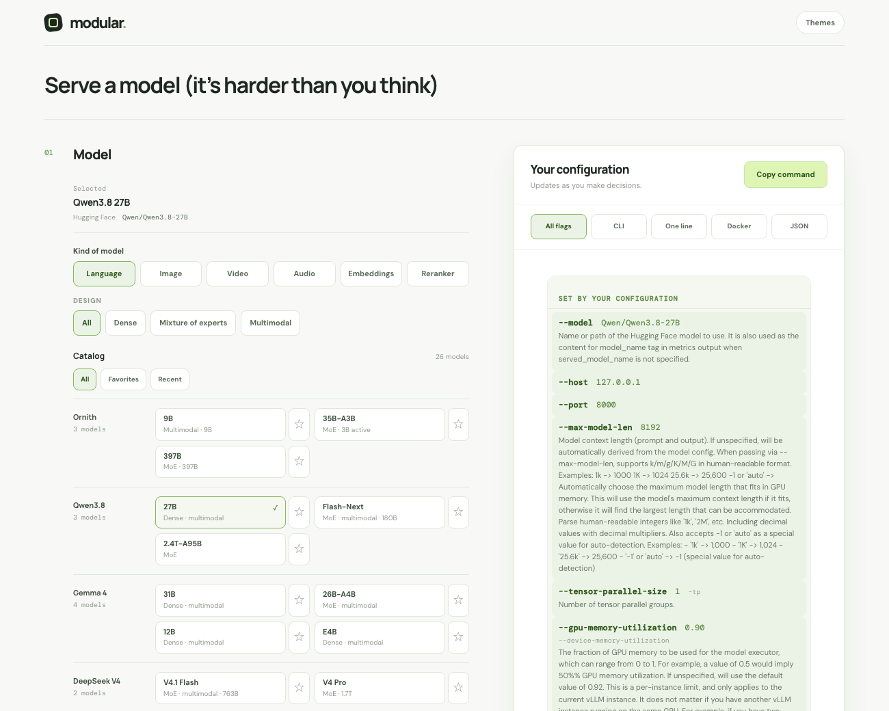

<picture>
  <source media="(max-width: 600px)" srcset="assets/readme/cover-mobile.png">
  
</picture>

<br>

<p align="center">
  
</p>

<p align="center">
  
  
  
  
  
  
</p>

<p align="center">
  <a href="#quick-start">Quick start</a> &nbsp;·&nbsp;
  <a href="#what-you-can-do-with-it">Use cases</a> &nbsp;·&nbsp;
  <a href="#how-it-works">How it works</a> &nbsp;·&nbsp;
  <a href="#inside-modular">Workspace</a> &nbsp;·&nbsp;
  <a href="#engines">Engines</a> &nbsp;·&nbsp;
  <a href="#road-to-a-finished-release">Roadmap</a>
</p>

<br>

**A difficult task deserves a thoughtful place to do it.**

Serving a model means bringing checkpoints, engines, hardware, and runtime settings into agreement. The requirements are strict, the conventions differ, and the details keep changing.

Modular gives that work a calmer shape. Choose a model, an engine, and the hardware you have. Modular assembles a launch command, explains where every flag came from, and tells you plainly when two choices disagree. The interface is spacious, the deeper controls open only where they apply, and the finished command is always in view beside you.

> **Modular is a prototype**, and the [roadmap](#road-to-a-finished-release) shows where it is headed.

<br>

<picture>
  <source media="(max-width: 600px)" srcset="assets/readme/interface-mobile.png">
  
</picture>

<br>

## What you can do with it

| If you are… | Modular helps you… | Where to look |
| --- | --- | --- |
| 🟢 **Standing up a model for the first time** | Pick a model and an engine, answer a few plain questions, and get a starting command without reading every flag reference. | Quick start |
| 🔵 **Moving between engines** | Switch from vLLM to SGLang or Ollama and keep your intent. Settings that do not translate are named instead of dropped. | Switch engines |
| 🟡 **Sizing for a GPU box** | Pick your card (B300 to RTX 3090), GPU count, tensor and pipeline parallelism, CPU offload, and KV cache. Get a real “will it start?” check against the card’s memory. | Hardware, Checks |
| 🟠 **Comparing configurations** | Save setups in the browser and restore model, engine, hardware, and settings together. | Save current |
| 🔴 **Handing a setup to someone else** | Copy readable CLI, a one-liner, JSON, or a vLLM Docker command. The flag map explains where each part came from. | Output |
| 🟣 **Trying your own fine-tunes** | Load up to 100 public repositories from a Hugging Face profile, or paste a reference, URL, or path. | Models |

<br>

## How it works

<p align="center">
  
</p>

Modular keeps **what you want** separate from **how each engine spells it**. You choose a model, an engine, and hardware; those choices form one configuration. The renderer turns that configuration into a command, and the checker reads the same configuration to report conflicts. Model, engine, hardware, and runtime settings stay independent dimensions, so changing one does not quietly rewrite another.

<br>

## Inside Modular

**01 &nbsp; Choose your starting point.** Start from what the model produces: language, image, video, audio, embeddings, or rerankers. Video shows Wan, click in for its variants. Or bring a reference or path, or load public repositories from a Hugging Face profile. Keep favorites and a default close at hand.

**02 &nbsp; Give the workload what it needs.** Choose an engine, your GPU card, context, and weight format. Scheduling, cache, offload, and network controls appear where relevant. Engine changes preserve choices and call out selected settings that do not translate.

**03 &nbsp; See what your choices mean.** Every flag the engine has, with the ones your setup sets highlighted, plus the flag map and checks. Copy an export or save a configuration in the browser for another session.

### Every part of the command is traceable

<p align="center">
  
</p>

### Switch engines without losing your intent

<p align="center">
  
</p>

<br>

## Principles

- 🟢 **Choices, not typing.** Buttons, presets, sliders, and switches carry the main decisions. Free text appears only where the value is free text: a model link, a host, a path, an extra argument.
- 🔵 **Nothing disappears silently.** If an engine has no equivalent for a setting, Checks says so, and the setting stays saved for when you switch back.
- 🟡 **Every flag has a reason.** The flag map traces each part of the command to the choice that produced it.
- 🟠 **Unknown stays unknown.** Modular never claims a model runs on an engine because both appear in a list.
- 🔴 **Your data stays with you.** No account, no token, no server. Favorites and saved configurations live in your browser.

<br>

## What the checks catch

| | Check | Example |
| --- | --- | --- |
| 🔴 | **GPU oversubscription** | Tensor GPUs × pipeline stages exceeds the GPU count you selected |
| 🟠 | **Settings an engine omits** | A saved device count, memory target, or parser choice the current engine cannot express |
| 🟡 | **Repeated or opposing arguments** | An extra argument duplicates a flag Modular already generated |
| 🔴 | **Will it start?** | Weights plus KV cache against your card: “Qwen3.8 27B needs about 52 GB; 20 GB is usable on 1 × RTX 4090”, “the KV cache holds only 32,700 tokens, less than your 131,072-token context”, “NVFP4 needs a Blackwell GPU; the H100 is not one”, each with the fix. Weights use each checkpoint’s real file size |
| 🔵 | **Risky combinations** | FP8 KV cache needs hardware support; eager mode disables CUDA graphs; CPU offload moves weights during inference; Docker needs the server bound to all interfaces |
| 🟢 | **Scheduling sanity** | A token batch smaller than the sequence limit may constrain scheduling |
| 🟢 | **Fixed KV cache** | A fixed allocation replaces the GPU memory target, and Modular says which flag it omitted |

<br>

## Tracker and saved state

The **Tracker** button in the top bar opens the project checklist: progress, filters by status, and a field to add tasks. Tasks update live: the server pushes changes over a WebSocket (`/api/events`), so the count in the top bar and the open dialog follow edits made anywhere, including by another tab or a script. Tasks live in `db/modular.db`, created from [`db/schema.sql`](db/schema.sql) and seeded from [ROADMAP.md](ROADMAP.md) the first time the server starts.

The same database keeps your **saved setups, favorites, default model, and Hugging Face profile name**, so they follow you across browsers on the same machine. Every saved shape is versioned, so newer and older copies of Modular can share the same data safely. The page still mirrors them to browser storage, which means it keeps working on a plain static server. The first time the server sees an empty database, it adopts what your browser already has.

<br>

## Themes

The **Themes** button in the top bar changes the whole surface at once. The choice is remembered in your browser and applied before the page paints, so there is no flash.

| | Theme | Character |
| --- | --- | --- |
| 🟢 | **Meadow** | The original: sage and cream |
| 🔵 | **Midnight** | Deep blue-graphite for late nights |
| 🟠 | **Paper** | Warm cream with a serif voice |
| ⚫ | **Terminal** | Phosphor green on black, all monospace, with a prompt and a caret |
| ⚪ | **macOS** | Light system chrome, blue accent, translucent toolbar, traffic lights |
| 🔷 | **Windows** | Fluent-style flat surfaces, squared corners, Segoe type, caption buttons |

Themes are built on about 35 named color roles plus radius and type variables, so adding another one is a single block of CSS. See the `css: themes` region in [index.html](index.html).

<br>

## Defaults

The first screen is a working, cautious starting point. Every default is a decision, and this is the reasoning.

| Setting | Default | Why |
| --- | --- | --- |
| Model | Qwen3.8 27B | A current-generation dense multimodal model; fits one 80 GB card with room for context |
| Engine | vLLM | The most widely deployed server for this job |
| Hardware | 1 × H100 80 GB | The most common data-center card; pick another and the memory check follows |
| Context | 8K tokens | Comfortable on small cards; raise it on purpose |
| Listens on | This machine (`127.0.0.1`) | An inference endpoint with no API key should not be reachable from the network by accident |
| Trust remote code | Off, except for Ornith | The flag runs Python from the model's repository on your server |
| GPU memory | 90% | Just under vLLM's own default (0.92), for headroom against spikes |
| Prefix caching | On | A free win when prompts share a beginning |
| Output | All flags | Shows every flag the engine has, so nothing is hidden behind a door |

Docker output listens inside the container and publishes only on your loopback, so the safe default works there too.

**All flags** lists every flag of the selected engine, straight from that engine’s own documentation (vLLM 311, SGLang 423, llama.cpp 255, TGI 56, TensorRT-LLM 50, Ollama 30, MLX LM 26). The flags your configuration sets are highlighted with their values; the rest show the documented default. Copy command copies the runnable command. `python3 tools/flags.py` re-reads the docs.

<br>

## Engines

| | Engine | Command shape | Notable controls in the prototype |
| --- | --- | --- | --- |
| 🟢 | **vLLM** | `vllm serve …` | Tensor and pipeline parallelism, CPU offload, fixed KV cache, priority scheduling, prefix caching, chunked prefill, dtype, request logging, Docker output |
| 🔵 | **SGLang** | `python -m sglang.launch_server …` | Tensor parallelism, static memory fraction, radix cache toggle, reasoning and tool-call parsers |
| 🟣 | **TensorRT-LLM** | `trtllm-serve …` | Tensor and pipeline parallelism, KV-cache memory fraction, sequence length; FP8 and NVFP4 checkpoints load as shipped |
| 🟡 | **TGI** | text-generation-inference | Shared context, GPU, and quantization choices |
| 🟠 | **llama.cpp** | llama.cpp server | Shared context, GPU, and quantization choices |
| 🔴 | **Ollama** | `ollama pull` + `ollama serve` with environment settings | Host, context length, parallel requests, GGUF references |
| ⚪ | **MLX LM** | MLX LM server | Shared context and quantization choices |

<details>
<summary>Models, engines, and output formats</summary>

| Dimension | Available in the prototype |
| --- | --- |
| Models | The current generation only, chosen from Hugging Face data: Qwen3.8, Gemma 4, DeepSeek V4, GLM-5.3, Kimi K3, gpt-oss, Nemotron 3, Granite 4.2, Mistral, Llama 4, FLUX.2, Wan 2.2, LTX-2.5, MiniMax-H3, current speech, music, embedding and reranker models, and Ornith. Older versions are left out unless there is a reason (Wan 2.2 and FLUX.1 dev are still what people run). Custom references, tags, URLs, and paths; up to 100 public repositories from a Hugging Face profile |
| Kinds | Language (Dense, Mixture of experts, Multimodal), Image, Video, Audio (speech to text, text to speech, music), Embeddings, Reranker |
| Views | All, Favorites, Recent |
| Model-specific controls | Ornith 1.5 checkpoint choices (BF16, FP8, NVFP4, GGUF where published) and conditional reasoning and tool-call parsers |
| Engines | vLLM, SGLang, TensorRT-LLM, TGI, llama.cpp, Ollama, MLX LM |
| Hardware | B300, B200, H200, H100, A100 80 GB and 40 GB, RTX PRO 6000, RTX 5090, 4090, 3090; or a memory size of your own |
| Tuning | Context, GPU count and memory, quantization, plus applicable scheduling, precision, cache, offload, network, and extra-argument controls |
| Output | All flags, readable CLI, one-line CLI, and JSON; Docker for vLLM. Image, video and speech/music generation have no launch command yet |

Catalog inclusion does not establish engine compatibility. Model, engine, hardware, and runtime choices remain separate dimensions.

</details>

<br>

## Quick start

From this directory:

```sh
python3 server.py
```

Open [127.0.0.1:8420](http://127.0.0.1:8420). No build step or account is required. The server listens on your machine only, serves the app, and keeps the [tracker](#tracker) in a local SQLite database. To use just the configurator, any static server works: `python3 -m http.server 8420`.

1. Start with **Qwen3.8 27B**, **vLLM**, and an **H100**.
2. Change a choice: context, GPU count, or engine.
3. Open **Where each choice goes** beneath the output to see the flag it produced.
4. **Save current** to keep the setup, or copy the command.

<br>

<details>
<summary>Local data and project files</summary>

Favorites, a default model, and saved configurations live in browser local storage. Recent models last for the current page session. The optional Hugging Face profile picker reads public data without asking for a token and remembers the profile name locally. Google Fonts and the public profile lookup are the page’s external requests.

| File | Purpose |
| --- | --- |
| [index.html](index.html) | Live, self-contained prototype, organized into named regions |
| [tools/map.py](tools/map.py) | Prints the region map of `index.html`, or one region by name |
| [server.py](server.py) | Local server: the app, a small JSON API over SQLite, and live task events |
| [db](db) | SQLite schema and roadmap seeding script |
| [ROADMAP.md](ROADMAP.md) | Checklist to a finished release |
| [LICENSE](LICENSE) | MIT license |
| [assets/readme](assets/readme) | Artwork, actual interface captures, generated ASCII-art SVGs (`ascii.py`), and editable README compositions |

</details>

<br>

## Road to a finished release

Modular is a prototype, and this is the plain list of what stands between it and a finished tool. It is ordered roughly by dependency. Items are checked off as they land, and the same list lives in [ROADMAP.md](ROADMAP.md).

### Foundation

- [x] **1. Separate the working copy.** Rollback is git: releases are tagged (`v0.7` is the first), risky work happens on a branch, and `next.html` is retired.
- [x] **2. Organize the single file.** `index.html` stays one self-contained file, formatted with one statement per line and split into 30 named regions marked `▸ name`. `python3 tools/map.py` prints the map of regions; `python3 tools/map.py checks` prints one region. Splitting into modules is deferred until tests or parallel work need it.
- [x] **3. Reconcile the docs with the app.** Resolved by deleting `DESIGN.md`, which had drifted from the app. It remains in git history.
- [x] **4. Version the saved data.** Saved setups, local-storage envelopes, and the server's `/api/state` now carry version numbers. Older data is upgraded when read (v0 setups gain a catalog reference and stop carrying favorites), and data written by a newer Modular is preserved and never overwritten.
- [ ] **5. Contributing guide.** The MIT license is in place (`LICENSE`). Still to write: short instructions for running, testing, and adding a model or engine.

### Trust

- [ ] **6. Versioned engine profiles.** Describe each engine's flags, defaults, accepted values, and conflicts as data per version, then generate the renderer and checks from it.
- [ ] **7. Engine version selector.** Let people pick the version they run, and show how defaults or spellings differ before export.
- [ ] **8. Source links and last-checked dates.** Link each version-specific flag to its documentation, and label unknown compatibility as unknown.
- [ ] **9. Automated tests.** Golden-file tests for every engine and output format, plus a test for each check (oversubscription, omitted settings, duplicate arguments).
- [x] **10. Better fit estimates.** Every catalog model with a published architecture now gets a real "will it start?" check: weights at the chosen precision, KV cache for a full-length request, attention heads divisible by the GPU count, CPU offload, and fixed KV memory, each with a concrete fix. Custom models and Ornith builds keep the weight-only note.
- [ ] **11. Input validation.** Validate pasted references, hosts, ports, paths, and extra arguments, and quote them safely in every output format.

### Reach

- [ ] **12. More command forms.** Add environment-variable output and Kubernetes or Compose snippets, generated from the same configuration state.
- [ ] **13. Complete the remaining engines.** Bring TGI, llama.cpp, and MLX LM to the same depth as vLLM and SGLang.
- [ ] **14. Share and import.** Export a configuration as a link or file and import it, so a setup can move between people and machines.
- [ ] **15. Catalog upkeep.** Refresh the curated models, and add a lightweight way to update the catalog without editing the page.
- [ ] **16. Private repositories.** Offer a clear, token-free path for private Hugging Face repositories beyond pasting an exact reference.

### Polish

- [ ] **17. Accessibility pass.** Keyboard-only walkthrough, screen-reader audit of the checks and flag map, contrast and reduced-motion checks.
- [ ] **18. Phone and tablet audit.** Review every breakpoint on real devices, including the live output panel and saved configurations.
- [ ] **19. Browser support matrix.** Test current Chrome, Safari, and Firefox, including clipboard fallbacks and local storage being unavailable.
- [ ] **20. Self-hosted fonts and offline mode.** Remove the Google Fonts request so the page works fully offline.
- [ ] **21. Continuous checks.** Run the tests and a link and asset check on every change.
- [ ] **22. Release.** Refresh screenshots with `assets/readme/render.py`, tag a version, deploy, and remove the "prototype" label from this README.
