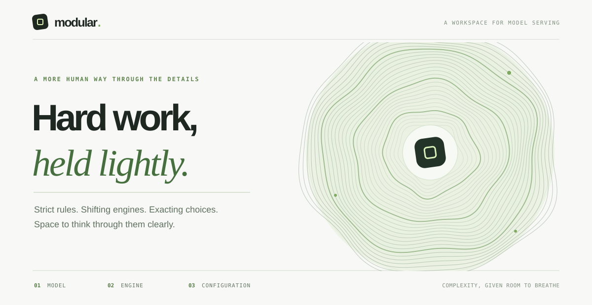

<p align="center">
  
</p>

<p align="center"><strong>Choose the pieces. See the command. Understand every flag.</strong></p>

Modular is a browser-based configurator for model-serving commands. Pick a checkpoint and a serving engine, set the hardware and runtime choices that matter, and inspect the generated output as it changes. The page also points out conflicting choices and settings the selected engine cannot express.

The interface takes its cues from a technical worksheet: numbered decisions on a warm paper canvas, fine separators, generous space, and a pale green accent reserved for active choices. A persistent output panel makes the command feel like the result of those decisions, with a clear path back to each setting.

```text
  01  MODEL                 02  ENGINE               03  CONFIGURATION
      Qwen3 8B                 vLLM                       1 GPU · 24 GB
      Hugging Face             SGLang                     8K context
      text generation         TGI · llama.cpp            memory · scheduling
                              Ollama · MLX LM            network · flags
                              or your own
            \                       |                       /
             +----------------------+----------------------+
                                    |
                                    v
                   +--------------------------------------+
                   | YOUR CONFIGURATION                   |
                   |                                      |
                   | vllm serve 'Qwen/Qwen3-8B' \        |
                   |   --host '0.0.0.0' --port 8000 \     |
                   |   --max-model-len 8192 ...           |
                   |                                      |
                   | CLI  /  ONE LINE  /  DOCKER  /  JSON |
                   |                                      |
                   | CHECKS  +  WHERE EACH CHOICE GOES   |
                   +--------------------------------------+
```

### What you can do

| Choose | Inspect | Keep |
| :--- | :--- | :--- |
| Browse 15 curated models, choose a published Ornith checkpoint build, paste another model reference, or load public models from a Hugging Face profile. | Switch among six named engines or supply a command template. Tune GPU count, memory, context, quantization, and engine-specific settings. | Copy or export a readable CLI command, a one-line command, or JSON. vLLM also has a Docker command. |
| Mark favorites and a default model. | Read checks for selected conflicts and omitted settings, then expand **Where each choice goes** to trace command parts to controls. | Save and restore configurations in this browser. |

### Open it

```sh
python3 -m http.server 8000
```

Visit `http://localhost:8000`. There is no build step or backend. Loading a Hugging Face profile fetches its public model list from the Hugging Face API; favorites and saved configurations live in browser storage.

### Project files

- [`index.html`](index.html) — the live prototype.
- [`next.html`](next.html) — the identical working copy.
- [`DESIGN.md`](DESIGN.md) — UX direction, design decisions, and iteration notes.
- [`catalog-draft.html`](catalog-draft.html) and [`original.html`](original.html) — earlier explorations.

<sub>Modular produces a starting specification. Check model, weights, hardware fit, and flags against the version of your serving engine before deployment.</sub>
