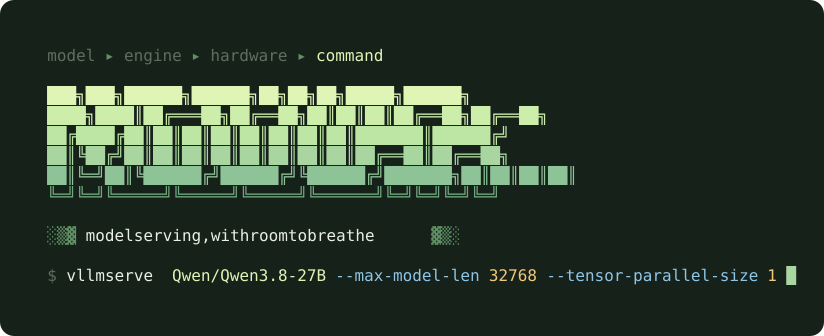
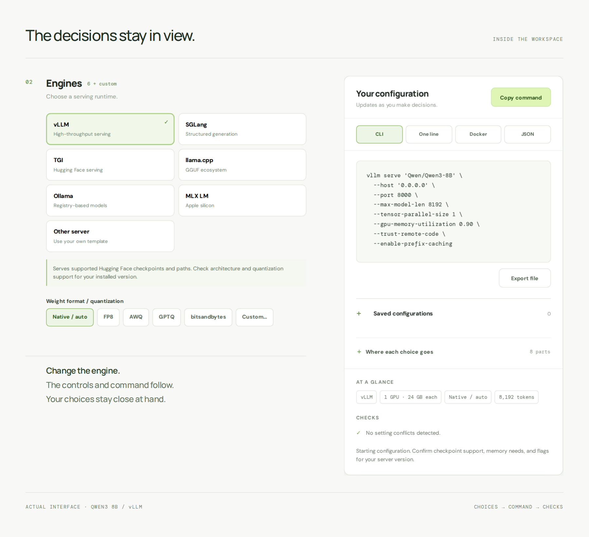
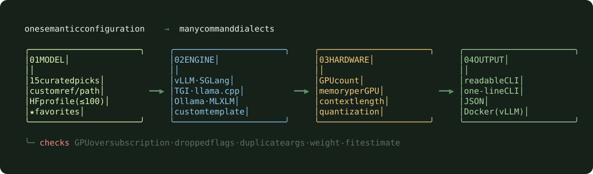
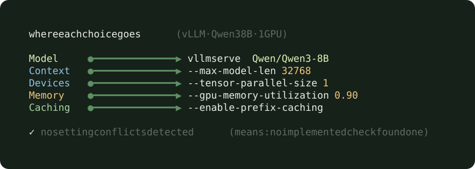
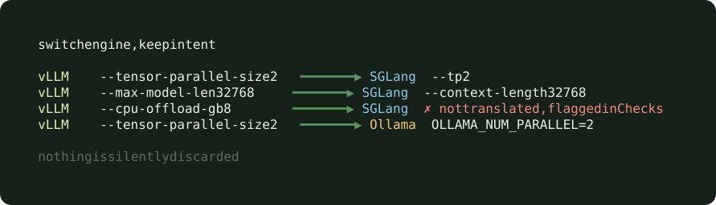

<picture>
  <source media="(max-width: 600px)" srcset="assets/readme/cover-mobile.png">
  
</picture>

<br>

<p align="center">
  
</p>

<p align="center">
  
  
  
  
  
</p>

<p align="center">
  <a href="#quick-start">Quick start</a> &nbsp;·&nbsp;
  <a href="#what-you-can-do-with-it">Use cases</a> &nbsp;·&nbsp;
  <a href="#how-it-works">How it works</a> &nbsp;·&nbsp;
  <a href="#inside-modular">Workspace</a> &nbsp;·&nbsp;
  <a href="#engines">Engines</a> &nbsp;·&nbsp;
  <a href="#honest-limits">Limits</a> &nbsp;·&nbsp;
  <a href="DESIGN.md">Design notes</a>
</p>

<br>

**A difficult task deserves a thoughtful place to do it.**

Serving a model means bringing checkpoints, engines, hardware, and runtime settings into agreement. The requirements are strict, the conventions differ, and the details keep changing.

Modular gives that work a calmer shape. Choose a model, an engine, and the hardware you have. Modular assembles a launch command, explains where every flag came from, and tells you plainly when two choices disagree. The interface is spacious, the deeper controls open only where they apply, and the finished command is always in view beside you.

> **Modular is a prototype.** It is a complete, working interface that generates a *starting specification* for a server. It does not install or launch anything, and it does not yet check against versioned engine profiles. See [Honest limits](#honest-limits) and the [roadmap](ROADMAP.md).

<br>

<picture>
  <source media="(max-width: 600px)" srcset="assets/readme/output-mobile.png">
  
</picture>

<br>

## What you can do with it

| If you are… | Modular helps you… | Where to look |
| --- | --- | --- |
| 🟢 **Standing up a model for the first time** | Pick a model and an engine, answer a few plain questions, and get a starting command without reading every flag reference. | Quick start |
| 🔵 **Moving between engines** | Switch from vLLM to SGLang or Ollama and keep your intent. Settings that do not translate are named instead of dropped. | Switch engines |
| 🟡 **Sizing for a GPU box** | Set GPU count and memory, tensor and pipeline parallelism, CPU offload, and KV cache. Get a weight-memory note and a warning on oversubscription. | Hardware, Checks |
| 🟠 **Comparing configurations** | Save setups in the browser and restore model, engine, hardware, and settings together. | Save current |
| 🔴 **Handing a setup to someone else** | Copy readable CLI, a one-liner, JSON, or a vLLM Docker command. The flag map explains where each part came from. | Output |
| 🟣 **Trying your own fine-tunes** | Load up to 100 public repositories from a Hugging Face profile, or paste a reference, URL, or path. | Models |

<br>

## How it works

<p align="center">
  
</p>

Modular keeps **what you want** separate from **how each engine spells it**. You choose a model, an engine, and hardware; those choices form one configuration. The renderer turns that configuration into a command, and the checker reads the same configuration to report conflicts. Model, engine, hardware, and runtime settings stay independent dimensions, so changing one does not quietly rewrite another.

<br>

## Inside Modular

**01 &nbsp; Choose your starting point.** Browse models by family, bring a reference or path, or load public repositories from a Hugging Face profile. Keep favorites and a default close at hand.

**02 &nbsp; Give the workload what it needs.** Choose an engine, context, weight format, and hardware. Scheduling, cache, offload, and network controls appear where relevant. Engine changes preserve choices and call out selected settings that do not translate.

**03 &nbsp; See what your choices mean.** The live command, flag map, and checks keep the result inspectable. Copy an export or save a configuration in the browser for another session.

### Every part of the command is traceable

<p align="center">
  
</p>

### Switch engines without losing your intent

<p align="center">
  
</p>

<br>

## Principles

- 🟢 **Choices, not typing.** Buttons, presets, sliders, and switches carry the main decisions. Free text appears only where the value is free text: a model link, a host, a path, an extra argument.
- 🔵 **Nothing disappears silently.** If an engine has no equivalent for a setting, Checks says so, and the setting stays saved for when you switch back.
- 🟡 **Every flag has a reason.** The flag map traces each part of the command to the choice that produced it.
- 🟠 **Unknown stays unknown.** Modular never claims a model runs on an engine because both appear in a list.
- 🔴 **Your data stays with you.** No account, no token, no server. Favorites and saved configurations live in your browser.

<br>

## What the checks catch

| | Check | Example |
| --- | --- | --- |
| 🔴 | **GPU oversubscription** | Tensor GPUs × pipeline stages exceeds the GPU count you selected |
| 🟠 | **Settings an engine omits** | A saved device count, memory target, or parser choice the current engine cannot express |
| 🟡 | **Repeated or opposing arguments** | An extra argument duplicates a flag Modular already generated |
| 🟡 | **Fit estimate** | A weight-only memory note for the chosen checkpoint and hardware |
| 🔵 | **Risky combinations** | FP8 KV cache needs hardware support; eager mode disables CUDA graphs; CPU offload moves weights during inference; Docker needs the server bound to all interfaces |
| 🟢 | **Scheduling sanity** | A token batch smaller than the sequence limit may constrain scheduling |
| 🟢 | **Fixed KV cache** | A fixed allocation replaces the GPU memory target, and Modular says which flag it omitted |

<br>

## Engines

| | Engine | Command shape | Notable controls in the prototype |
| --- | --- | --- | --- |
| 🟢 | **vLLM** | `vllm serve …` | Tensor and pipeline parallelism, CPU offload, fixed KV cache, priority scheduling, prefix caching, chunked prefill, dtype, request logging, Docker output |
| 🔵 | **SGLang** | `python -m sglang.launch_server …` | Tensor parallelism, static memory fraction, radix cache toggle, reasoning and tool-call parsers |
| 🟡 | **TGI** | text-generation-inference | Shared context, GPU, and quantization choices |
| 🟠 | **llama.cpp** | llama.cpp server | Shared context, GPU, and quantization choices |
| 🔴 | **Ollama** | `ollama pull` + `ollama serve` with environment settings | Host, context length, parallel requests, GGUF references |
| 🟣 | **MLX LM** | MLX LM server | Shared context and quantization choices |
| ⚪ | **Custom** | your own template | Extra arguments checked for repeats and opposing flags |

<details>
<summary>Models, engines, and output formats</summary>

| Dimension | Available in the prototype |
| --- | --- |
| Models | 15 curated starting points across Ornith, Qwen, Reasoning, Vision, and Other groupings, including Llama 3.3 70B, Gemma 3 27B, Phi-4, Mixtral 8x7B, DeepSeek R1 Distill 32B, Qwen2.5 VL 7B, Whisper large v3, Stable Diffusion XL, and BGE embedding and reranking models; custom references, tags, URLs, and paths; up to 100 public repositories from a Hugging Face profile |
| Views | All, Favorites, Recent, Text, and Other |
| Model-specific controls | Ornith 1.5 checkpoint choices (BF16, FP8, NVFP4, GGUF where published) and conditional reasoning and tool-call parsers |
| Engines | vLLM, SGLang, TGI, llama.cpp, Ollama, MLX LM, and a custom command template |
| Tuning | Context, GPU count and memory, quantization, plus applicable scheduling, precision, cache, offload, network, and extra-argument controls |
| Output | Readable CLI, one-line CLI, and JSON; Docker for vLLM |

Catalog inclusion does not establish engine compatibility. Model, engine, hardware, and runtime choices remain separate dimensions.

</details>

<br>

## Quick start

From this directory:

```sh
python3 -m http.server 8000
```

Open [localhost:8000](http://localhost:8000). No build step or account is required.

1. Start with **Qwen3 8B** and **vLLM**.
2. Change a choice: context, GPU count, or engine.
3. Open **Where each choice goes** beneath the output to see the flag it produced.
4. **Save current** to keep the setup, or copy the command.

<br>

## Honest limits

Modular is a working prototype that produces a **starting specification**. Its checks cover selected conflicts; confirm the output against the engine version, checkpoint, and hardware you intend to use.

| ✅ It does | ⚠️ It does not |
| --- | --- |
| Catch GPU oversubscription | Install or launch a server |
| Flag settings an engine omits | Verify engine versions or architecture support |
| Warn when extra arguments repeat or oppose generated flags | Inspect checkpoint contents |
| Estimate weight memory for the chosen checkpoint | Measure real memory headroom, KV cache, or activations |
| Say “no setting conflicts detected” | Promise that message means the setup will run. It means no implemented check found a conflict |

The path to a finished product is in [ROADMAP.md](ROADMAP.md). [DESIGN.md](DESIGN.md) records the intended direction, including versioned engine profiles, source links with last-checked dates, and broader compatibility rules that are not implemented yet.

<br>

<details>
<summary>Local data and project files</summary>

Favorites, a default model, and saved configurations live in browser local storage. Recent models last for the current page session. The optional Hugging Face profile picker reads public data without asking for a token and remembers the profile name locally. Google Fonts and the public profile lookup are the page’s external requests.

| File | Purpose |
| --- | --- |
| [index.html](index.html) | Live, self-contained prototype |
| [next.html](next.html) | Current working copy |
| [DESIGN.md](DESIGN.md) | Product direction and iteration history |
| [ROADMAP.md](ROADMAP.md) | Checklist to a finished release |
| [catalog-draft.html](catalog-draft.html), [original.html](original.html) | Earlier explorations |
| [assets/readme](assets/readme) | Artwork, actual interface captures, generated ASCII-art SVGs (`ascii.py`), and editable README compositions |

</details>
